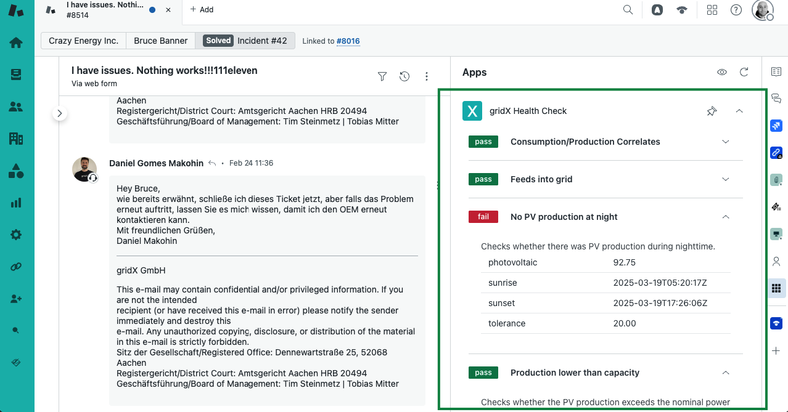
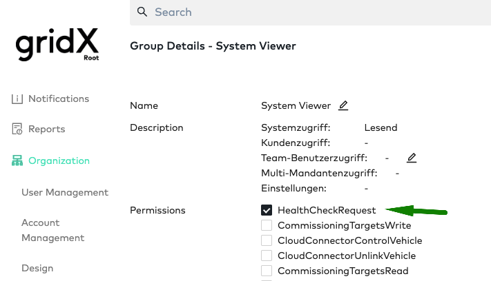
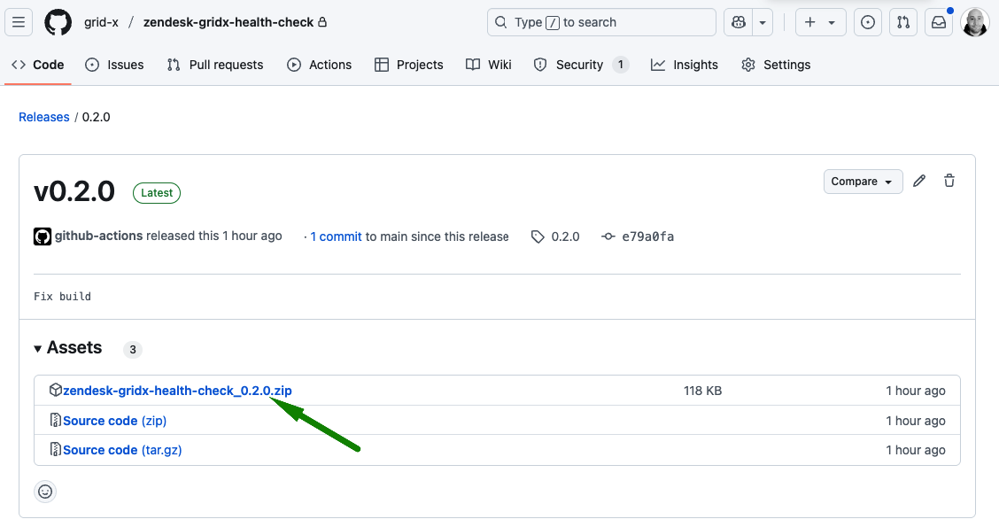
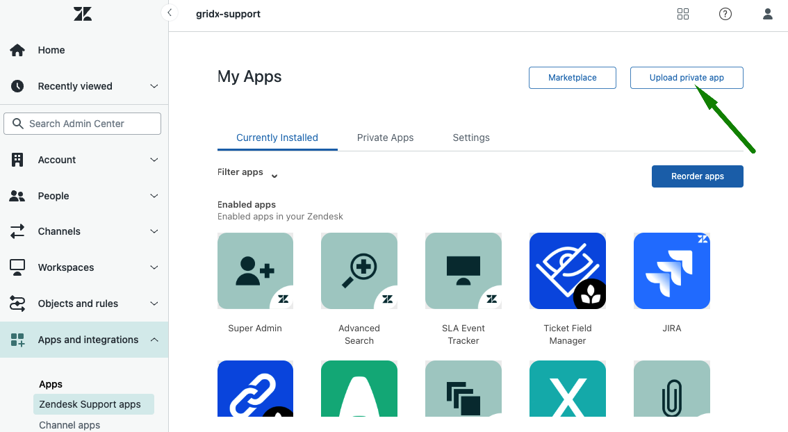
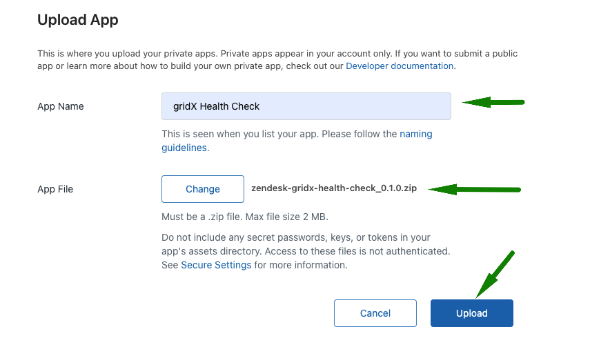
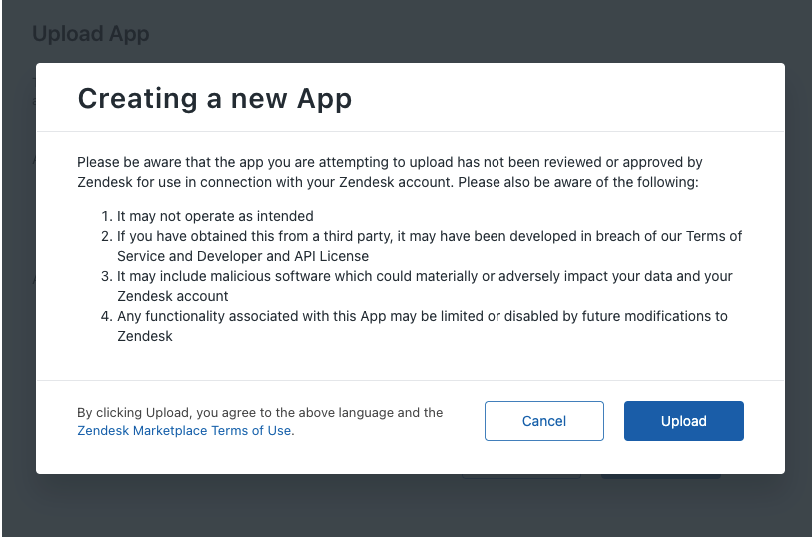
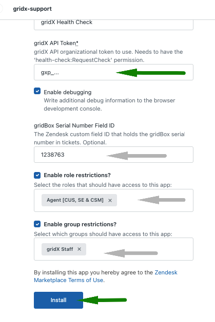
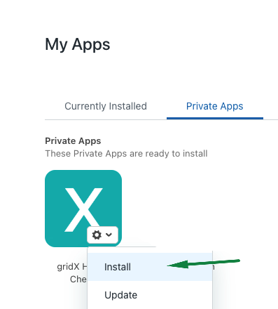

*Use of this software is subject to important terms and conditions as set forth in the License file*

# Zendesk gridX Health Check

Zendesk gridX Health Check is a Zendesk Support App that allows running checks against gridBoxes in the field.


## Synopsis

gridX provides a suite of health checks for gridBoxes [via API](https://community.developer.gridx.de/t/gridx-api-documentation/213#post-/health-checks). We use this internally within our support team to help them diagnose issues and mis-configuration of devices in the field more efficiently.
New checks are made available on a regular basis to cover additional scenarios as they become know.
These checks will be available in Zendesk through this app automatically without having to update this app.

## 📖 Usage

The app takes a gridBox serial number as input and runs all available checks against it. It reports the result along with a description of checks and some metadata about failures. If the serial number is available in a custom field, it uses it automatically. 
That's it.

## 📦 Installation

To install the App into your Zendesk instance, proceed as follows.

1. Make sure you have a policy group having the `HealthCheckRequest` permission set up
   
2. Create an organizational token for gridX API access as described in the [gridX developer community](https://community.developer.gridx.de/t/good-practice-using-organizational-tokens/152#p-230-creating-an-organizational-token-2)
   and make note of it.
   ```sh
   curl -X POST "https://api.gridx.de/account/tokens" \
     -H 'accept: application/vnd.gridx.v2+json'\
     -H 'content-type: application/json' \
     -d '{"description":"gridX Zendesk Token","expiresAt":"2025-03-18T17:37:59Z","email":"john@doe.com","groups":["<group id from step 1>"]}' 
   ```
3. Get the [latest release](https://github.com/grid-x/zendesk-gridx-health-check/releases/latest) from this repository.
4. Download the `.zip`file
   
5. Open your Zendesk admin console (`your-instance.zendesk.xom/admin/apps-integrations/apps/support-apps`)
6. Select `Upload private app`
  
1. Enter `gridX Health Check` as name, select the `.zip` file downloaded before and `Upload` it
  
1. Proceed at the next dialog
   
2. On the configuration screen, enter the following and click `Install`
   1. The API token created previously
   2. Whether you want to see additional debug information in the 
      browser's development console
   3. Optionally, the ID of the custom field holding the gridBox serial number,
      if you have it set up in your Zendesk instance.
   4. Role and group descriptions, if you need to.
      
3. From the `Private Apps` tab, `Install` the app to make it available.
   

To update, grab the new release from this repository and select `Update` from the existing App's context menu.

## 🔧 Development

### Prerequisites

- [`zcli`](https://developer.zendesk.com/documentation/apps/getting-started/using-zcli/#installing-and-updating-zcli),  the Zendesk development CLI tool
- [`Node.js`](https://nodejs.org/en/) >= 18.12.1
- Access to a Zendesk instance with permissions to install apps

For additional details on building Zendesk Apps, please refer to the [scaffold repository](https://github.com/zendesk/app_scaffolds/tree/master/packages/react#readme) and the [official documentation](https://developer.zendesk.com/documentation/apps/app-developer-guide/getting_started/).

### Running locally

To serve the app to your Zendesk instance with `?zcli_apps=true`, follow the steps below:

- `npm install` - install dependencies
- `npm run dev` - in one terminal, start the dev server
- `npm run start` - in a second terminal, expose the app so it can be displayed in Zendesk

Now open a ticket in Zendesk and append `?zcli_apps=true` to the URL. The app will display as support app now.

> **Note:** Running the `npm run dev` command enables Hot Module Replacement (HMR), which allows you to see the changes you make to your code immediately without having to manually refresh the page. This greatly enhances the development experience.

### 🏗️ Building

To build an package the app for upload, run the following in the project root.

```sh
zcli apps:bump -m src
npm run build  
RELEASE_VERSION=$(jq -r ".version" src/manifest.json)
zcli apps:package dist
mv dist/tmp/*.zip dist/tmp/zendesk-gridx-health-check_$RELEASE_VERSION.zip
```

This will create a zip file ready to upload as a Zendesk Support App in `dist/tmp`.
